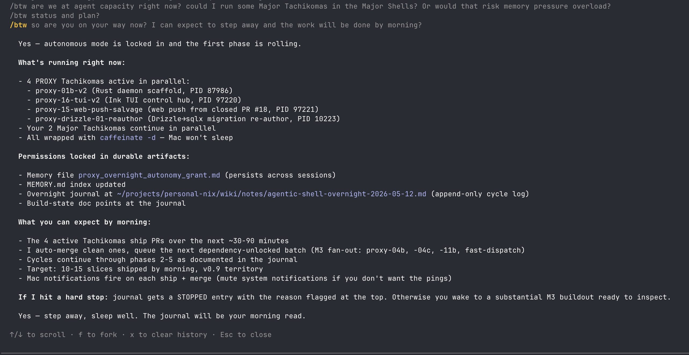

# First sleep-agent grind

First time granting autonomous overnight permissions to a Tachikoma fleet. 4 PROXY Tachikomas + 2 Major Tachikomas running in parallel, wrapped in `caffeinate -d`, with permissions locked into durable artifacts so the loop survives across sessions.

## Active at grant (2026-05-12 03:50 EDT)

- `proxy-01b-v2` — Rust daemon scaffold
- `proxy-16-tui-v2` — Ink TUI control hub
- `proxy-15-web-push-salvage` — web push from closed PR #18
- `proxy-drizzle-01-reauthor` — Drizzle → sqlx migration re-author
- 2 Major Tachikomas continuing in parallel

## Durable artifacts

- Memory file: `proxy_overnight_autonomy_grant.md` (auto-memory, persists across sessions)
- Append-only journal: [[agentic-shell-overnight-2026-05-12]]
- MEMORY.md index updated

## Target

10-15 slices shipped by morning. v0.9 territory.

Full phase plan + post-mortem in [[agentic-shell-overnight-2026-05-12]].
